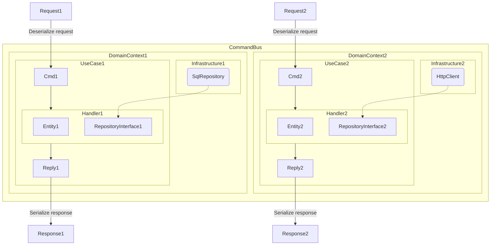

# Доменные контексты и свой фреймворк с CommandBus.

## Запуск

* `docker compose up -d` (create `compose.override.yaml`)
* `docker exec -i -t md-app sh`
* `make migrate`

## Тесты

`make test` or `make coverage-html`

## Остальное команды

`make help`

## Мультики

